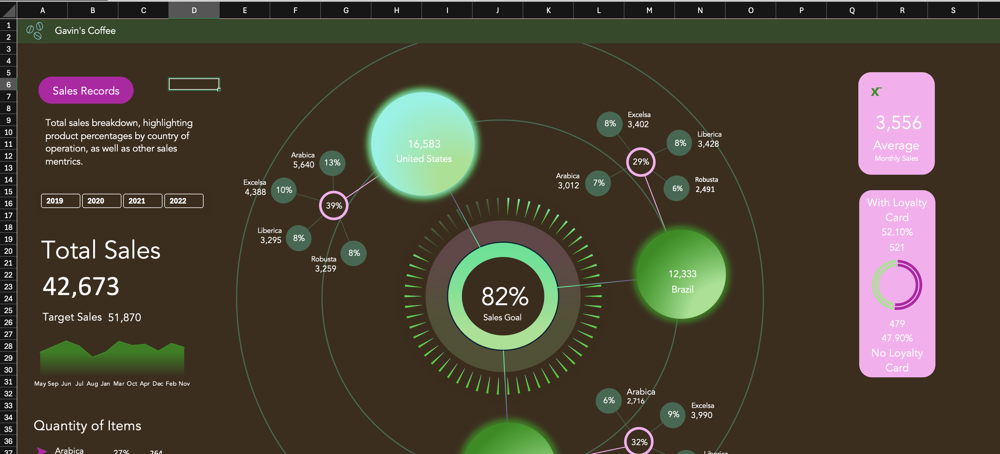
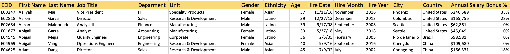
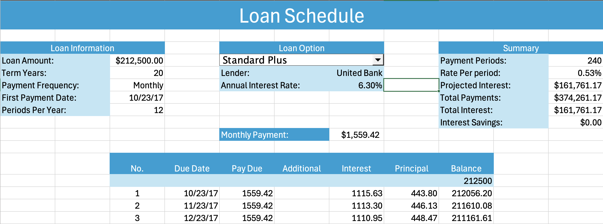
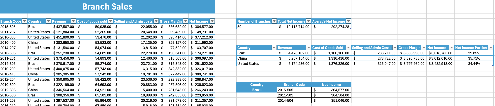

# Business Excel Worksheets

Overview 

This collection of worksheets pretain to a fictitious company to showcase my excel work. Each one covers a different facet of business, employing different methods, techniques, and formulas. The details of each worksheet can be found below, along with the methods and functions utilized.

Sales Dashboard

This worksheet is meant to display the company's sales data through a dynamic, appealing, and easy to understand dashboard. The central part breaks down the sales data by country then product, highlighting the one with the majority sales. The right side displays quick visuals, being average monthly sales and the ratio of loyalty card use in purchases. The left side has metrics including total sales, target sales, a graph of sales per month, and the breakdown of the different coffees ordered. - The whole dashboard adjusts to the year slicer found on the left. 

For this dashboard, it was necessary to create easy to understand graphs/designs using advanced design element techniques. In creating the charts and dynamic metrics for the dashboard, a separate sheet was used to create all of the charts and table values that were to be used. This made the construction of the dashboard a lot simpler. - Every element on the dashboard is either a text box with a cell/sheet reference or a shape. No cells on the sheet have text or values, making it easier to be precise and manipulate. - In terms of design, a large focus was dialing in the colors, size, and layout, to make the dashboard feel seamless. 

The techniques used for the dashboard: data series formatting, shape formatting, pivot tables, custom graphs, dual axis graphs, data selection for graphs, slicers, Vlookup, If function, alignment tools, icons, symbols, cell/sheet references, layering, grouping

Employee Data Cleaning

The purpose of this worksheet is to take raw employee data and make it clean, sorted, and usable for tracking, searching, and functional tables.

In doing so, I kept the original data and worked off a copy to ensure a backup. From there, I used a seperate sheet to process and clean the data using functions so that they can be dragged down and used to process new/added data. No matter how many lines are added or removed, the functions should allow for it to automatically process and sort the data displayed in the "Sorted Clean Data" sheet.

The functions and techniques used include: Substitute, Trim, Find, Mid, Left, Right, CHAR, Value, Isnumber, Len, Code, Date, Text, Dollar, CountIfs, Row, Match, Index, nested functions, flexible structures, cell+sheet references, formatting 

Adjustable Loan Schedule

This worksheet is a fully adjustable loan schedule calculator, allowing for different lenders, terms, payment frequencies, rates, and additional payments throughout the life of the loan. Such a tool can be used for running the numbers on potential real estate and large asset acquisitions. 

It was built from scratch with the intention of referencing a list of potential lenders, which are found on the "Loan Options" sheet. Thus, it had to take the user entered data and the referenced loan information and use it to generate the schedule. A column for additional payments was added, which had to be factored in to change the duration of the loan. This also allowed for a spot to show the saved interest from the additional payments. 

The functions and techniques used include: Data Validation, Combo Box, Array Functions, nested functions, Named Ranges/References, cell/sheet references, formatting, IF, Offset, Transpose, PMT, SUM, EDate, *,+,/,<=

Branch Revenue/Income & Stock

This excel workbook reviews branch revenue, calculating net income, and summary data. It also looks over each branch's current stock and calculates the associated values through an array function. 

With the "Branch Revenue" sheet, we have the data stored in a table, with the last two columns 'Gross Margin' and 'Net Income' as calculated fields. In doing so, the generated summary measures make use of the tables name structures/references for cleaner and flexible calculations. The "Branch Stock" sheet records the amount of units for each product on hand and are used to calculate total value and value by branch/product using array functions.

The functions and techniques used include: Data Validation, Array Functions, nested functions, Table Name References, cell/sheet references, formatting, COUNTA, SumIf, Match, Index, Large, Sum, -, /, *

